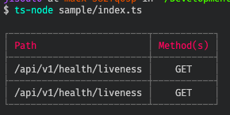
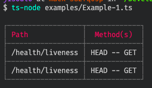

> [!IMPORTANT]
> This repo has been archived as I've switched to [Elysia][0] for my preferred API framework.
>
> Feel free to fork and modify this repo to suit your needs.


# @4lch4/koa-router-printer

This repo is a lightweight utility for Koa.js applications that utilize @koa/router. It outputs a two-column table containing the registered path(s) and method(s).

## Examples

> NOTE: These examples are also available in [the examples directory](examples/index.ts).

### Example 0

```typescript
Printer(app, {
  displayHead: false,
  displayPrefix: true
})
```



### Example 1

```typescript
Printer(app, {
  displayHead: true,
  displayPrefix: false
})
```



## Options

The module accepts two options along with the app parameter:

- `displayHead`
  - Whether or not to display the HEAD method with a path.
- `displayPrefix`
  - Whether or not to display the prefix ahead of each Route path.

[0]: https://elysiajs.com
